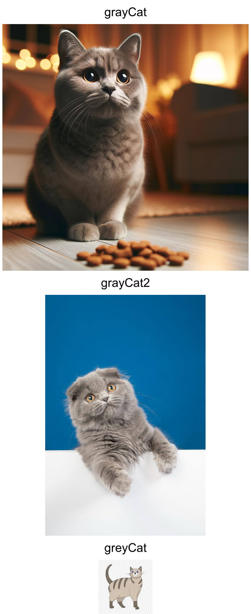
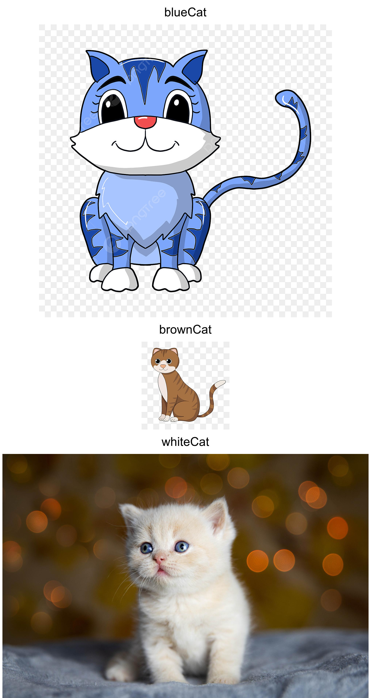

# Image Stacking Project

## Description

This project consists of two Bash scripts designed to process and stack images in a directory. `stack-images.bash` processes all images in a given directory, appending a white box with the image name to each and then stacking them vertically. `process-subdirectories.bash` extends this functionality to each subdirectory of a given parent directory.

## Prerequisites

- Bash shell (typically available on Linux and macOS systems)
- ImageMagick installed on your system

## Installation

1. Clone or download the repository to your local machine.
2. Ensure both scripts (`stack-images.bash` and `process-subdirectories.bash`) are in the same directory and have execute permissions. You can set execute permissions using:
   ```bash
   chmod +x stack-images.bash process-subdirectories.bash
   ```

## Usage

### stack-images.bash

This script processes all images in a specified directory. It appends a white box with the image's filename to the top of each image and then stacks them vertically into a single image.

**Syntax:**

```bash
./stack-images.bash <directory_path>
```

- `<directory_path>`: The path to the directory containing the images you want to process.

### process-subdirectories.bash

This script applies `stack-images.bash` to each subdirectory of a given parent directory.

**Syntax:**

```bash
./process-subdirectories.bash <parent_directory_path>
```

- `<parent_directory_path>`: The path to the directory containing the images you want to process.

## Examples

1. To stack images in a specific directory:

```bash
./stack-images.bash /path/to/directory
```

2. To stack images in each subdirectory of a specific directory:

```bash
./process-subdirectories.bash /path/to/parent/directory
```

## Example Output

Here are some examplesof the output generated by the script:




